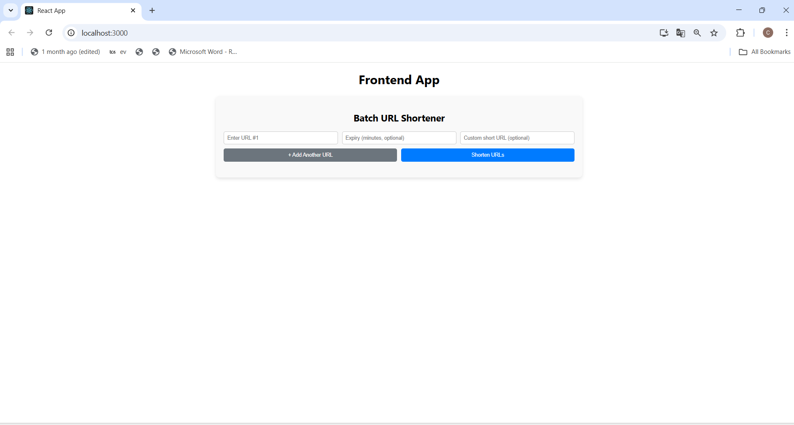
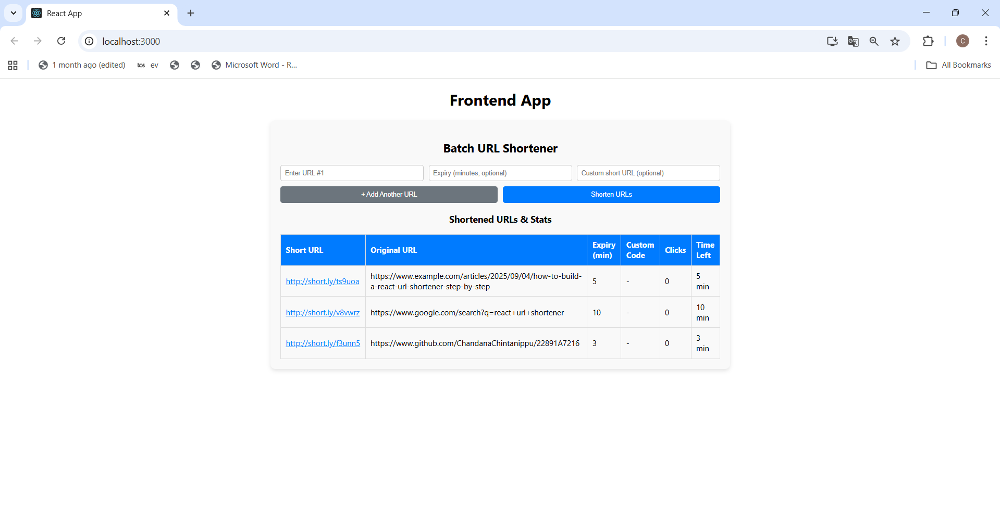

# Batch URL Shortener with Logging Middleware

## Overview
This project is a **Batch URL Shortener** built using **React + TypeScript**.  
It supports shortening **up to 5 URLs at once**, with optional expiry time and custom short codes.  
All major actions (URL shortening, clicks, expiry) are logged using a **logging middleware** to the test server API.

---

## Features

1. **Batch URL Shortening**
   - Input up to 5 URLs at a time.
   - Optional expiry (in minutes).
   - Optional custom short URL code.

2. **Click Tracking**
   - Counts number of clicks per shortened URL.
   - Opens the original URL in a new tab on click.

3. **Expiry Handling**
   - Automatically removes URLs after expiry.
   - Displays time left for each URL.

4. **Logging Middleware**
   - Logs every significant event to the backend API:
     - URL shortened
     - URL clicked
     - Expired URLs removed
   - API Endpoint: `POST http://20.244.56.144/evaluation-service/logs`
   - Example log:
     ```json
     {
       "stack": "frontend",
       "level": "info",
       "package": "component",
       "message": "Shortened URL: http://short.ly/abc123 for https://example.com"
     }
     ```

---

## How to Run

# 1. Navigate to the frontend directory:

cd "Frontend Test Submission/client"

# 2. Install dependencies:

-npm install

# 3.Start the development server

-npm start

# 4.Open the app in your browser
-Visit:http://localhost:3000

## Notes

- Use the "+ Add Another URL" button to add more URLs (max 5).
- Custom short codes must be alphanumeric, underscores, or hyphens.
- Expiry time in minutes is optional; leave blank for no expiry.
- Logs are sent automatically to the API endpoint using logEvent middleware.

## Screenshots
### 1. Batch URL Input


### 2. Shortened URLs & Stats



